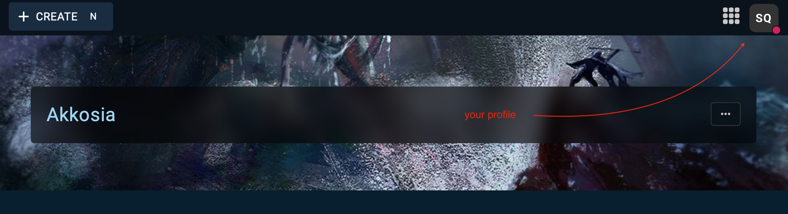
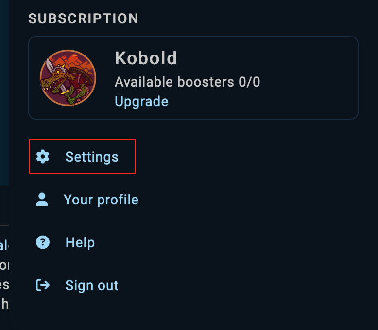
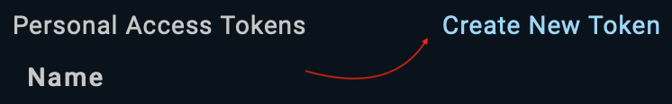
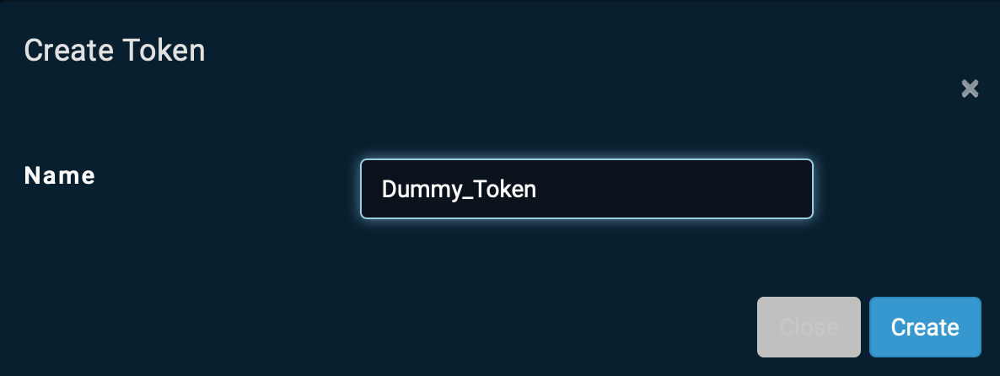
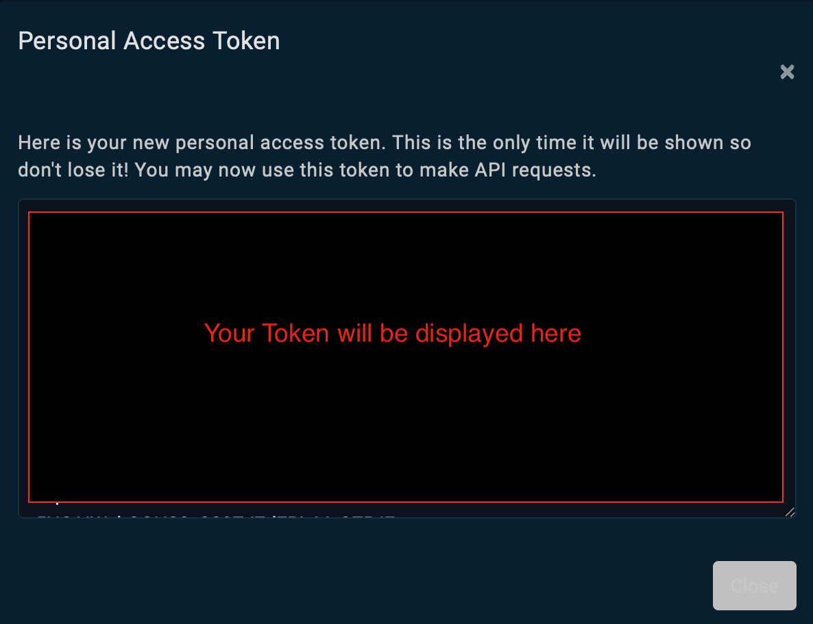

# How to Set-Up this tool

## Generating a oAuth Token

To use the Kanka API this tool needs a oAuth token that you can generate in your Kana profile. 

> 
>
> Navigate to the dropdown menu on the top right of the Kanka UI.

> 
>
> Scroll all the way down to find the settings

> 
>
> Navigate to the API subsettings

> 
>
> Click on `Create New Token`

> 
>
> Give it any name though ideally you should remember what this token is used for.
> The Token generated remains valid for one year or until manually deleted.

> 
>
> You should see a pop up window like this with a wall of text.
> Copy this text into a file called `key.txt` in the same subdirectory as you keep `KankaHandler.py`.
> This is important as this is where the tool will get the key from!
